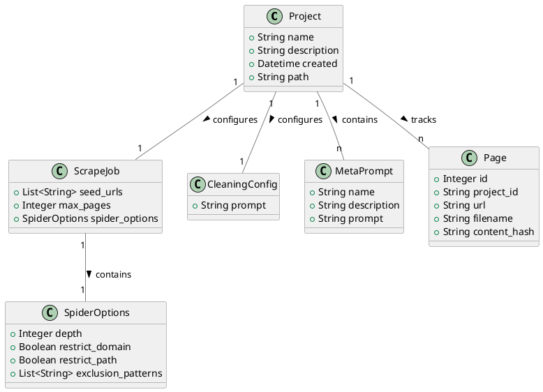
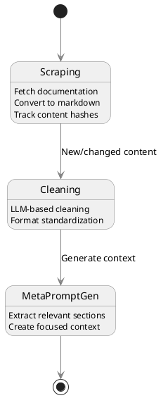
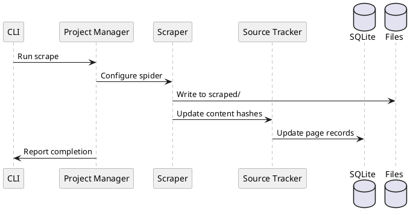
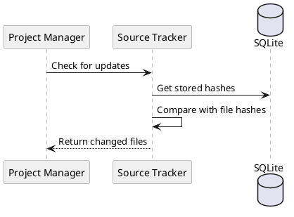
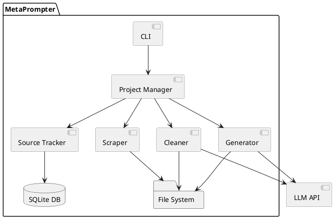
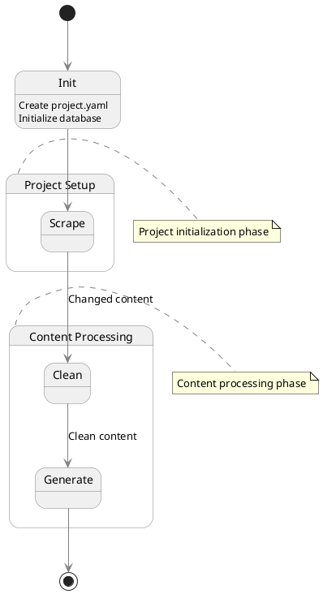

# MetaPrompter
Software Requirements Specification

## 1. Overview
MetaPrompter is a Python-based tool that helps developers create focused documentation context (meta-prompts) for AI coding assistants. It manages the workflow of scraping documentation, cleaning it, tracking changes, and generating context-specific documentation extracts.

## 2. Core Requirements

### 2.1 Project Management
- Projects are the main organizational unit, representing a framework or library documentation set
- Project configuration stored in YAML file
- Source tracking managed in SQLite database
- Projects track:
  - Scraping configuration
  - Source content state
  - Cleaning configuration
  - Meta-prompt definitions

### 2.2 Project Configuration
```yaml
# project.yaml - Project configuration
name: "langchain-tools"
description: "LangChain documentation for tool development"
created: "2024-11-07"
scrape_job:
  seed_urls:
    - "https://python.langchain.com/docs/modules/agents/tools/"
  spider_options:
    follow_links:                     # Whether to follow links found in pages
    restrict_domain: true             # Restrict to domain of seed URL
    restrict_path: true               # Restrict to path of seed URL
    max_depth: 3                      # How deep to crawl from seed URL
    max_pages: 100                    # maximum page count
    exclusion_patterns:               # URLs matching these patterns will be skipped
      - "*/api/*"
      - "*/changelog/*"
      - "*/legacy/*"

cleaning:
  prompt: |
    Clean the following documentation while:
    1. Removing navigation elements
    2. Standardizing formatting
    3. Preserving code examples
    Content: {content}

meta_prompts:
  tool_creation:                      # Will generate meta_prompts/tool_creation.md
    description: "Context for creating custom LangChain tools"
    prompt: |
      Extract relevant documentation sections for:
      Task: Creating custom tools in LangChain
      Requirements:
      - Focus on tool interface
      - Include essential methods
```

### 2.3 Data Models


### 2.4 Database Schema

```plantuml
@startuml
!define table(x) class x << (T,#FFAAAA) >>
!define primary_key(x) <b>x</b>
!define foreign_key(x) <i>x</i>

skinparam backgroundColor #FFFFFF
skinparam class {
    BackgroundColor #F0F0F0
    BorderColor #808080
}

hide methods
hide stereotypes

table(pages) {
  primary_key(id) INTEGER
  foreign_key(project_id) TEXT
  url TEXT
  filename TEXT
  content_hash TEXT
}
@enduml
```


### 2.5 Project Structure
```
project_dir/
├── project.yaml           # Project configuration
├── project.db            # SQLite database for source tracking
├── scraped/              # Raw scraped markdown files
│   ├── page1.md
│   └── page2.md
├── cleaned/              # LLM-cleaned markdown files
│   ├── page1.md
│   └── page2.md
└── meta_prompts/         # Generated context files
    └── tool_creation.md
```

## 3. Core Workflows

### 3.1 Overall Process Flow


### 3.2 Scraping Workflow


### 3.3 Content Change Detection


### 3.4 Component Structure


## 4. Command Line Interface

### 4.1 Commands
```bash
metaprompter init <name>      # Create new project
metaprompter scrape           # Run scrape job
metaprompter status          # Show file status
metaprompter clean           # Run cleaning job
metaprompter generate <name> # Generate meta-prompt
```

### 4.2 Command Flow


## 5. Error Handling
- Basic error logging to file
- Clear error messages for user
- Graceful handling of:
  - Network errors during scraping
  - LLM API errors
  - File system errors
  - Database errors

## 6. Performance Considerations
- Efficient hash comparison
- Process only changed files
- Simple database queries
- Standard logging instead of database history

## 7. Future Extensions
- Web UI for interactive refinement
- Template system for cleaning prompts
- Multiple framework versions
- Direct AI assistant integration

Would you like me to:
1. Add more detailed workflow diagrams?
2. Expand any section further?
3. Add more implementation details?
4. Include additional error scenarios?
5. Detail specific components further?