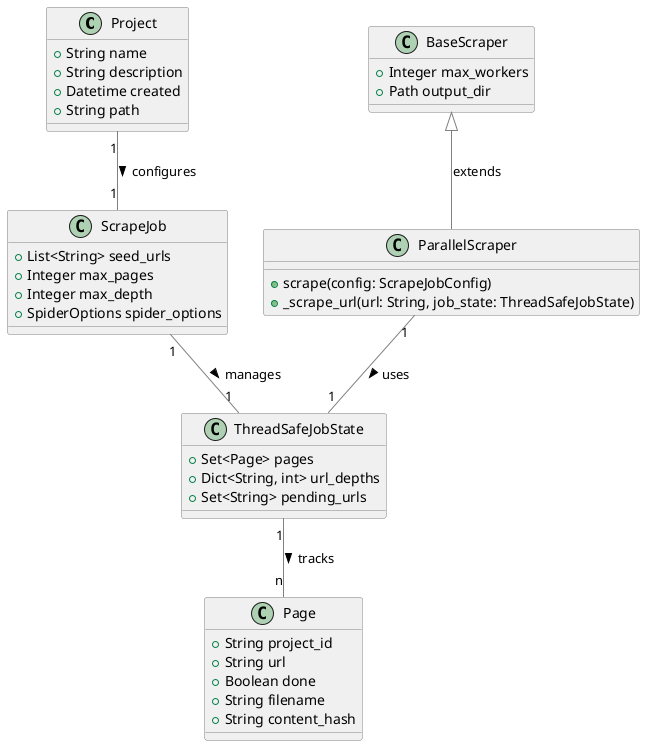
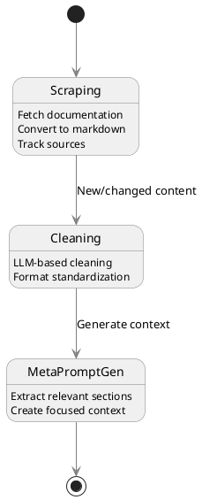
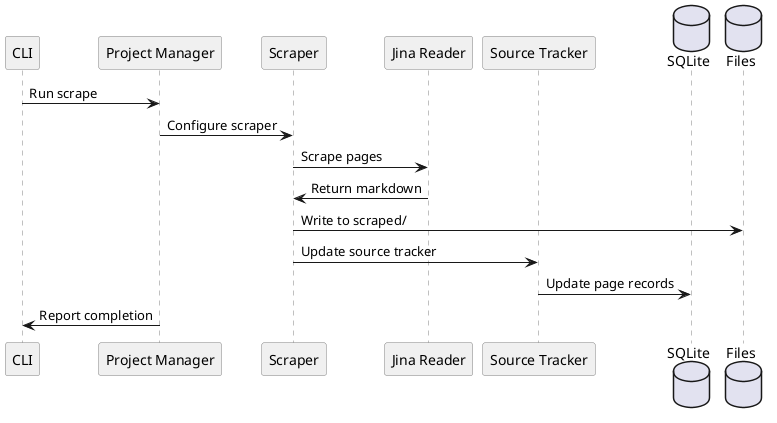
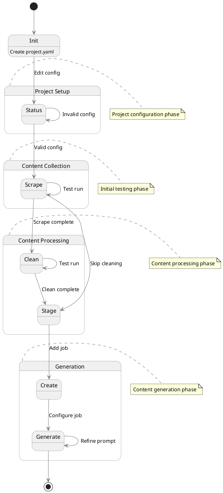

# MetaPrompter
Software Requirements Specification

## 1. Overview
MetaPrompter is a Python-based tool that helps developers create focused documentation context (meta-prompts) for AI coding assistants. It manages the workflow of scraping documentation, cleaning it, tracking changes, and generating context-specific documentation extracts. The system uses Jina Reader API to standardize HTML content conversion to markdown, ensuring consistent formatting across different documentation sources.

### 1.1 Documentation Collection
The system scrapes documentation websites from the internet, starting from specified seed URLs. It intelligently traverses documentation structures while respecting domain and path restrictions to collect relevant pages. Using the Jina Reader API, it converts HTML-based documentation into standardized markdown format, preserving code examples and essential formatting while removing navigation elements and other web-specific artifacts. This ensures a consistent base format regardless of the original documentation's presentation style.

### 1.2 Content Processing
After collection, the raw markdown content undergoes a cleaning process using LLM-based transformations. This process:
- Standardizes formatting and structure across different documentation sources
- Removes redundant or navigational content
- Preserves and properly formats code examples and technical content
- Maintains semantic relationships between different sections
- Tracks content changes to avoid reprocessing unchanged documentation
The cleaned content serves as the foundation for generating focused meta-prompts.

### 1.3 Meta-Prompt Generation
Meta-prompts are context-specific documentation extracts tailored for specific development tasks. The generation process:
- Takes a task-specific prompt template as input
- Analyzes the cleaned documentation to identify relevant sections
- Extracts and reorganizes content to match the task context
- Maintains links between related concepts and examples
- Creates focused, self-contained documentation suitable for AI coding assistants
The resulting meta-prompts provide precise, relevant context for specific development tasks while maintaining technical accuracy.

### 1.4 Cost Management
The system implements token-aware operations to manage LLM usage costs effectively:
- Counts tokens before executing LLM operations
- Provides cost estimates before processing stages
- Prompts user confirmation for operations exceeding configured thresholds
- Tracks token usage across different processing stages
- Enables users to monitor and control processing costs
This ensures transparency and control over LLM-related expenses while maintaining processing quality.

## 2. Core Requirements

### 2.1 Project Management
- Projects are the main organizational unit, representing a framework or library documentation set
- Project configuration stored in YAML file
- Source tracking managed in SQLite database
- Projects track:
  - Scraping configuration
  - Source content state
  - Cleaning configuration
  - Meta-prompt definitions

### 2.2 Project Configuration
```yaml
# project.yaml - Project configuration
name: "langchain-tools"
description: "LangChain documentation for tool development"
created: "2024-11-07"
cost_control:
  token_counting: true               # Enable token counting before LLM operations
  prompt_threshold: 1000             # Prompt user if operation exceeds this token count
scrape_job:
  seed_urls:
    - "https://python.langchain.com/docs/modules/agents/tools/"
  spider_options:
    follow_links:                     # Whether to follow links found in pages
    restrict_domain: true             # Restrict to domain of seed URL
    restrict_path: true               # Restrict to path of seed URL
    max_depth: 3                      # How deep to crawl from seed URL
    max_pages: 100                    # maximum page count
    exclusion_patterns:               # URLs matching these patterns will be skipped
      - "*/api/*"
      - "*/changelog/*"
      - "*/legacy/*"
  content_conversion:
    use_jina_reader: true            # Use Jina Reader API for HTML to markdown conversion

cleaning:
  prompt: |
    Clean the following documentation while:
    1. Removing navigation elements
    2. Standardizing formatting
    3. Preserving code examples
    Content: {content}

meta_prompts:
  tool_creation:                      # Will generate meta_prompts/tool_creation.md
    description: "Context for creating custom LangChain tools"
    prompt: |
      Extract relevant documentation sections for:
      Task: Creating custom tools in LangChain
      Requirements:
      - Focus on tool interface
      - Include essential methods
```

### 2.3 Data Models


### 2.4 Database Schema


### 2.5 Project Structure
```
project_dir/
├── project.yaml           # Project configuration
├── project.db            # SQLite database for source tracking
├── scraped/              # Raw scraped markdown files
│   ├── page1.md
│   └── page2.md
├── cleaned/              # LLM-cleaned markdown files
│   ├── page1.md
│   └── page2.md
├── staged/               # Staged document files to be used for meta-prompt generation
│   ├── page1.md
│   └── page2.md
└── meta_prompts/         # Generated context files
    └── tool_creation.md
```

## 3. Core Workflows

### 3.1 Overall Process Flow


### 3.2 Scraping Workflow


### 3.3 Content Change Detection


### 3.4 Component Structure


## 4. Command Line Interface

### 4.1 Commands
```bash
mp init <project> <options>      # Create new project with default config
mp status <project>     # Display project status and validate project configuration
mp scrape <project>     # Run scrape job
mp clean <project>      # Run cleaning job
mp stage <project>      # Stage documents for generation
mp create <project> <job> <options> # Create new generation job 
mp generate <project> <job>  # Run generation job

create options
--prompt # Generation prompt template
--model # LiteLLM model identifier
--max-tokens # Maximum tokens for generation
--temperature # Temperature for generation
```
### 4.2 Command Flow


## 5. Implementation Hints
- Use Jina Reader API for HTML to markdown conversion
- Use SQLite database for project configuration and source tracking
- Use LiteLLM for LLM operations
- Use uv for project management, e.g. `uv add <dependency>`
- Use the local .env python environment
- Follow the coding guidelines in specs/CONVENTIONS.md

## 6. Performance Considerations
- Efficient hash comparison
- Process only changed files
- Simple database queries
- Standard logging instead of database history

## 7. Future Extensions
- Web UI for interactive refinement
- Template system for cleaning prompts
- Multiple framework versions
- Direct AI assistant integration
- Alternative HTML to markdown converters as fallback options
- Quality validation system for LLM outputs
- Automated meta-prompt effectiveness scoring
- Content accuracy verification tools